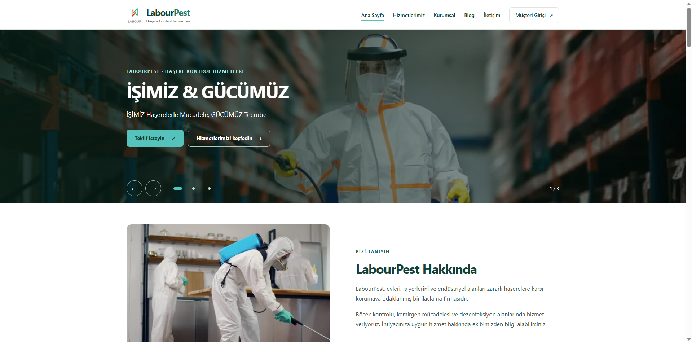
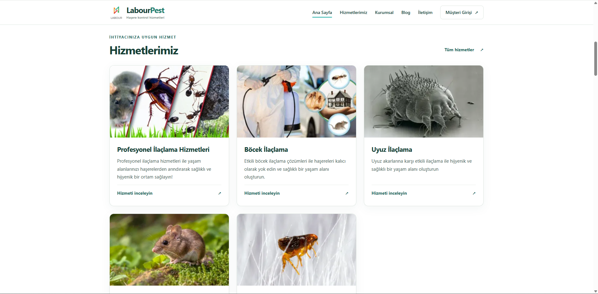
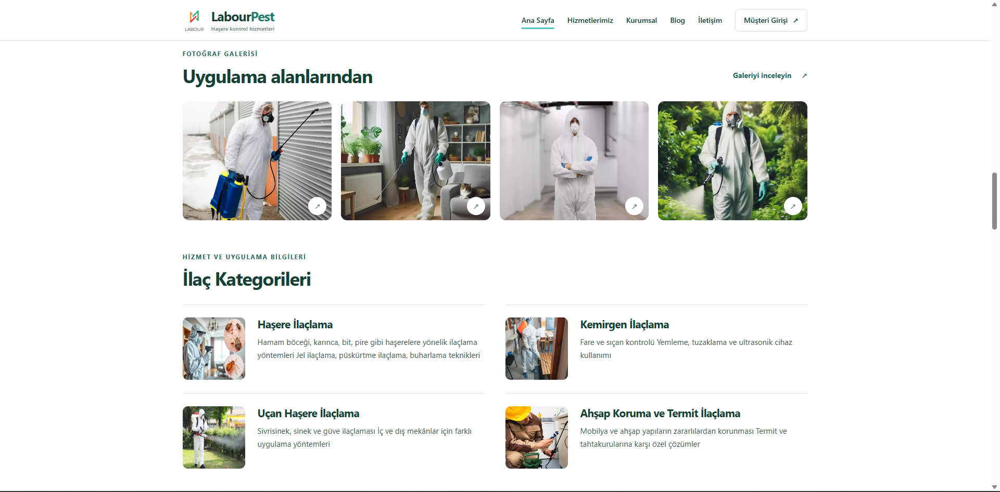
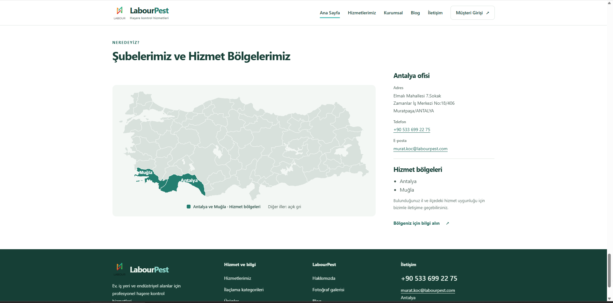

# LabourPest

## Türkçe

LabourPest, haşere kontrol hizmetlerini tanıtan ASP.NET Core MVC web sitesi ve mevcut API katmanlarından oluşur. Projenin ayrıca ayrı bir Flutter mobil uygulaması vardır. **Bu güncelleme public web sitesi, yorum gönderimi, CAPTCHA ve performans iyileştirmelerini kapsar; API veya Flutter uygulamasının yeniden tasarımı değildir.**

[Canlı web sitesi](https://labourpest.com/) · [English](#english)

### Proje yapısı ve teknolojiler

- `Asp.NetCore6.0_LabourPest_Project`: .NET 6, ASP.NET Core MVC, Razor view/component'leri; public site ve mevcut yönetim/müşteri ekranları.
- `Asp.NetCore6.0_LabourPest_Project_API`: mevcut ASP.NET Core API; bu public-web çalışmasında değiştirilmedi.
- `BusinessLayer`, `DataAccessLayer`, `EntityLayer`, `CoreLayer`: mevcut katmanlı yapı; veri erişiminde EF Core 6.0.36 ve SQL Server.
- Public arayüz: HTML, CSS, vanilla JavaScript, SVG Türkiye haritası ve Google reCAPTCHA v2 checkbox.
- `tools/public-images`: yalnız görsel türetmek için Node.js/Sharp; web sunucusunda Node.js zorunlu değil.
- `tests/PublicWeb.Tests`: xUnit, ASP.NET Core TestHost ve izole SQL Server LocalDB regresyonları.
- Flutter/Dart mobil uygulaması yerel çalışma alanında ayrı Git deposudur; bu depoya yeni submodule veya mobil kaynak eklenmedi.

### Public web özellikleri

Duyarlı ana sayfa; hizmetler, kurumsal bilgiler, blog, ürün/kategori içerikleri, fotoğraf galerisi, SSS, iletişim ve iş başvurusu görünümlerini aynı tasarımda birleştirir. Slider, müşteri yorumu geçişleri, hover/focus efektleri, galeri lightbox ve SSS açılma animasyonları; klavye kullanımı ve azaltılmış hareket tercihiyle birlikte desteklenir. Hizmet alanı haritasında Antalya ve Muğla vurgulanır.

Müşteri yorumları mevcut `MainComment/AddComment` MVC akışından kaydedilir. Fotoğraf isteğe bağlıdır; eksik fotoğraf mevcut yerel avatarla eşlenir. Sunucu tarafında alan doğrulaması, antiforgery ve CAPTCHA zorunludur. Başarı yalnız kayıt tamamlandıktan sonra gösterilir; hata mesajlarında uygun girişler korunur. Gönderim sonrası yönlendirme ve istemci kilidi yanlışlıkla tekrarlanan gönderimleri azaltır; genel sunucu idempotency garantisi vermez.

İlk slider görseli öncelikli yüklenir; sonraki görseller hazırlanarak geçiş yapılır. Responsive WebP türevleri orijinal yönetim paneli görsellerini değiştirmez. Yeni/değişmiş kaynaklarda orijinal görsele dönüş vardır. CAPTCHA form yaklaşınca veya odak alınca yüklenir; doğrulama atlanmaz.

### Ekran görüntüleri

Kullanıcının sağladığı güncel public ekranlardan seçilmiştir. Özel yönetim/müşteri ekranları ve müşteri yorumlarında kişisel/sağlık bilgisi içeren görüntüler yayınlanmamıştır. Kaynak görüntüler korunmuştur.

**Ana sayfa — masaüstü**



**Hizmetler**



**Fotoğraf galerisi**



**İletişim ve hizmet bölgeleri**



### Performans ve doğrulama

**Kullanıcı, PageSpeed Insights performansının mobil ve masaüstünde 100 olduğunu bildirmiştir.** Sağlanan ekran görüntüleri arasında bu sonucu doğrulayan PageSpeed raporu veya ölçüm tarihi yoktur. Bu nedenle sonuç kullanıcı bildirimi olarak belirtilir; tüm Lighthouse kategorilerinin 100 olduğu veya sonraki her ölçümde aynı skor alınacağı iddia edilmez. Bu README hazırlanırken yeni PageSpeed testi yapılmadı.

Ayrı, önceki yerel Release fixture ölçümünde üç koşunun medyanı mobil 97, masaüstü 100 idi; bu bir canlı site ölçümü değildir. Ayrıntılar, sınırlar ve gerçek CAPTCHA ekranları [teknik raporda](docs/public-web-review-performance.md). Önceki 160 tarayıcı kontrolü geçti; yayın paketinin build/test sonucu [sonlandırma notunda](docs/public-web-release.md) bulunur.

### Yerel kurulum ve build

.NET 6 hedefini derleyebilen SDK ve .NET 6 runtime gerekir. Depo kökünde:

```powershell
dotnet restore Asp.NetCore6.0_LabourPest_Project/Asp.NetCore6.0_LabourPest_Project.csproj
dotnet build Asp.NetCore6.0_LabourPest_Project/Asp.NetCore6.0_LabourPest_Project.csproj -c Release --no-restore
```

Normal site çalışması için mevcut şemayla uyumlu yerel SQL Server veritabanı ve içerik gereklidir. Bu commit'teki paylaşılan `Context`, `.` üzerindeki `LabourPestDB` için Windows kimlik doğrulaması kullanır; bağlantı mekanizması bu public-web çalışmasında değiştirilmedi. Sadece appsettings'e bir `ConnectionStrings` alanı eklemek bu eski Context'in bağlantısını değiştirmez. Mevcut migrasyonlar incelenmeden üretime veya mevcut veritabanına otomatik uygulanmamalıdır. Regresyon testleri ise kendi izole LocalDB veritabanlarını oluşturur.

CAPTCHA için yalnız **yerel geliştirme oturumunda**, kendi geliştirme key pair'inizi güvenli kaynaktan sağlayın; aşağıdakiler gerçek anahtar değildir:

```powershell
$env:Recaptcha__SiteKey = '<DEVELOPMENT_SITE_KEY>'
$env:Recaptcha__SecretKey = '<DEVELOPMENT_SECRET_KEY>'
dotnet run --project Asp.NetCore6.0_LabourPest_Project --no-launch-profile
```

Üretimde mevcut public site key ile eşleşen `Recaptcha__SecretKey`, sunucunun güvenli environment/configuration mekanizmasında tanımlanmalıdır. Secret yoksa yorum kaydı kapalı kalır. Secret, parola, token, User Secrets veya özel bağlantı bilgilerini Git'e eklemeyin. Üretim/test anahtarlarını karıştırmayın.

İzole yorum regresyonları için Windows ve `MSSQLLocalDB` gereklidir:

```powershell
dotnet test tests/PublicWeb.Tests/PublicWeb.Tests.csproj -c Release
```

[Test açıklaması](tests/PublicWeb.Tests/README.md) · [Görsel türetme](tools/public-images/README.md)

### Geliştirici

Mevcut tasarım/geliştirici atfı: **Yunus İNAN** — [GitHub](https://github.com/Terabithia1572) · [Instagram](https://www.instagram.com/yunusiinan/).

---

## English

LabourPest consists of an ASP.NET Core MVC website for pest-control services and an existing API. The project also has a separate Flutter mobile application. **This update covers the public website, review submission, CAPTCHA and performance; it does not redesign the API or Flutter app.**

[Live website](https://labourpest.com/) · [Türkçe](#türkçe)

### Structure and technology

- `Asp.NetCore6.0_LabourPest_Project`: .NET 6, ASP.NET Core MVC and Razor views/components; public pages and existing administration/customer screens.
- `Asp.NetCore6.0_LabourPest_Project_API`: existing ASP.NET Core API, unchanged by this work.
- `BusinessLayer`, `DataAccessLayer`, `EntityLayer`, `CoreLayer`: existing layered architecture; EF Core 6.0.36 and SQL Server.
- Public UI: HTML, CSS, vanilla JavaScript, SVG service-area map and Google reCAPTCHA v2 checkbox.
- Node.js/Sharp is a build-only image tool; xUnit, TestHost and isolated SQL Server LocalDB support regression tests.
- The Flutter/Dart application exists as a separate local Git repository. No mobile source or new submodule is added here.

### Public website

Responsive home, services, company, blog, product/category, gallery, FAQ, contact and job-application views share a consistent design. Hero/review transitions, hover/focus effects, gallery lightbox and FAQ animation retain keyboard access and reduced-motion support. The service-area map highlights Antalya and Muğla.

Reviews use the existing `MainComment/AddComment` MVC persistence flow. Photos remain optional, with an existing local avatar used when missing. Server validation, antiforgery and CAPTCHA precede persistence; success is displayed only after saving. Appropriate input survives errors. Redirect-after-submit and a client lock reduce accidental duplicate submissions without promising server-wide idempotency.

The first hero image loads with priority. Responsive WebP derivatives preserve administration-managed originals and fall back when sources change. CAPTCHA loads as the form approaches the viewport or receives focus; server verification remains mandatory.

### Screenshots

These curated screenshots show the current public interface. Private administrative/customer views and review screenshots containing personal/health information are excluded. Originals were preserved.

<details>
<summary>View the public website gallery</summary>


</details>

### Performance and validation

**The user reports PageSpeed Insights performance scores of 100 on mobile and desktop.** No confirming PageSpeed screenshot or measurement date was supplied, so this remains user-reported. This does not claim 100 in every Lighthouse category or guarantee future scores. No new PageSpeed measurement was run for this README.

Earlier local Release fixture medians were 97 mobile and 100 desktop across three runs each; those are not production measurements. See the [technical report](docs/public-web-review-performance.md) for evidence and limitations. The earlier 160 browser checks passed; final publishable-tree validation is recorded in the [release note](docs/public-web-release.md).

### Setup and build

Use an SDK capable of building .NET 6 and the .NET 6 runtime. From the repository root:

```powershell
dotnet restore Asp.NetCore6.0_LabourPest_Project/Asp.NetCore6.0_LabourPest_Project.csproj
dotnet build Asp.NetCore6.0_LabourPest_Project/Asp.NetCore6.0_LabourPest_Project.csproj -c Release --no-restore
```

The running website requires an existing compatible local SQL Server database and content. The shared Context in this commit uses Windows authentication against `LabourPestDB` on `.`. This public-web update does not change that connection mechanism; merely adding a `ConnectionStrings` setting does not reconfigure the legacy Context. Review existing migrations before applying them to any existing database. Regression tests create their own isolated LocalDB databases.

For a **local development session**, supply your own development key pair from a secure source; these placeholders are not real keys:

```powershell
$env:Recaptcha__SiteKey = '<DEVELOPMENT_SITE_KEY>'
$env:Recaptcha__SecretKey = '<DEVELOPMENT_SECRET_KEY>'
dotnet run --project Asp.NetCore6.0_LabourPest_Project --no-launch-profile
```

Before production use, configure `Recaptcha__SecretKey` to match the existing public site key through the server's secure environment/configuration mechanism. Missing configuration fails closed. Never commit secrets, passwords, tokens, User Secrets or private connection details; keep development and production keys separate.

Regression tests require Windows and SQL Server LocalDB `MSSQLLocalDB`:

```powershell
dotnet test tests/PublicWeb.Tests/PublicWeb.Tests.csproj -c Release
```

[Test guide](tests/PublicWeb.Tests/README.md) · [Image derivative tool](tools/public-images/README.md)

### Author

Existing design/developer attribution: **Yunus İNAN** — [GitHub](https://github.com/Terabithia1572) · [Instagram](https://www.instagram.com/yunusiinan/).
